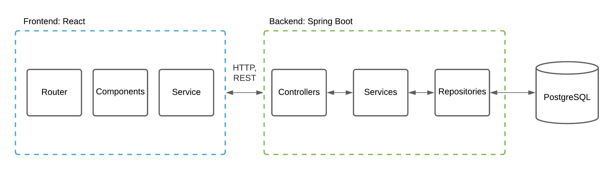

# AuctionHub

AuctionHub is a web application for buying and selling various products using auction system.

- Frontend application: [`https://auction-abh.herokuapp.com`](https://auction-abh.herokuapp.com/) <br>
- Backend application: [`https://auction-abh-server.herokuapp.com`](https://auction-abh-server.herokuapp.com/) <br>
- Swagger UI: [`https://auction-abh-server.herokuapp.com/swagger-ui/`](https://auction-abh-server.herokuapp.com/swagger-ui/)

## Features

| 1. month | 2. month | 3. month |
| --- | --- | --- |
| ERD, project skeleton | Forgot password | Wishlist |
| Registration and login | Product sorting | Payment (using Stripe) |
| Static pages (with header and footer) | List and grid preview | Notifications centre (socket) |
| Landing page | "Did you mean" feature? | Related products |
| Item page | Sell page (add new item as seller) |  Seller rating |
| Deployment | User profile page  | |
| Categories preview page and product list |  |  |
| Basic search functionality |  |  |
| Bidding items | |  |

## Architecture

The following is a diagram of the application architecture:


## How To Use :wrench:

To clone and run this application, you will need [Git](https://git-scm.com), [Java](https://www.oracle.com/java/technologies/javase-downloads.html),
[Maven](https://maven.apache.org/download.cgi) and [Node.js](https://nodejs.org/en/download/).

```bash
# Clone this repository
$ git clone https://github.com/kkadusic/auction-app

# Go into the root directory
$ cd auction-app
```

- ##### Backend application
```bash
# Add following environment variables:
JDBC_DATABASE_URL=
JDBC_DATABASE_USERNAME=
JDBC_DATABASE_PASSWORD=
SCHEMA_DB=
JWT_SECRET=
JWT_EXPIRATION=
EMAIL_USERNAME=
EMAIL_PASSWORD=
HOST_URL=
STRIPE_API_KEY=
SCHEDULE_RATE=
```

```bash
# Go into the backend directory
$ cd backend

# Run the server
$ mvn spring-boot:run
```

- ##### Frontend application
```bash
# Add following environment variables:
REACT_APP_API_URL=
REACT_APP_CLOUD_NAME=
REACT_APP_UPLOAD_PRESET=
```

```bash
# Go into the fronted directory
$ cd frontend

# Install dependencies
$ npm install

# Run the client
$ npm start
```
